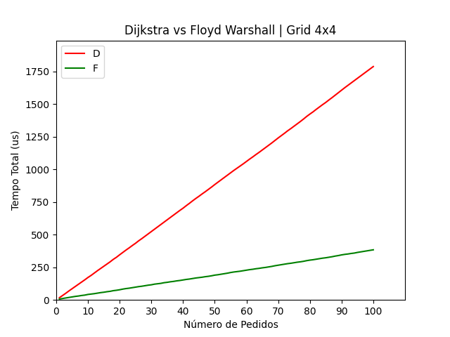
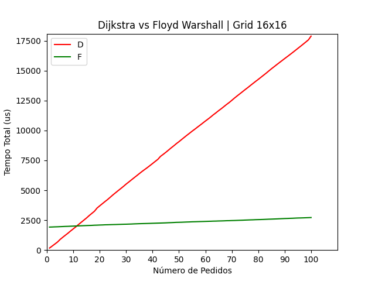
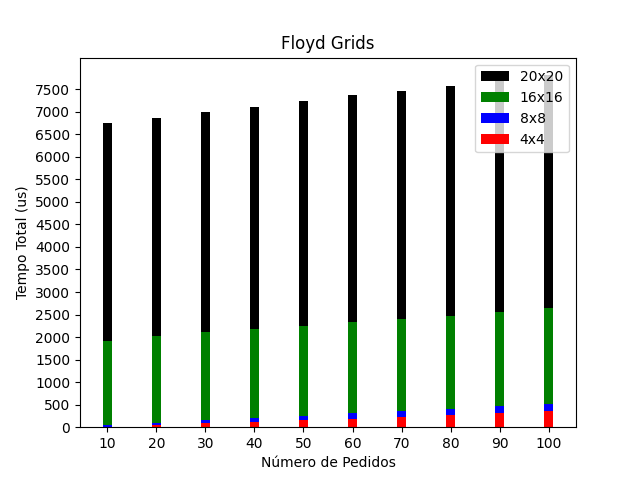
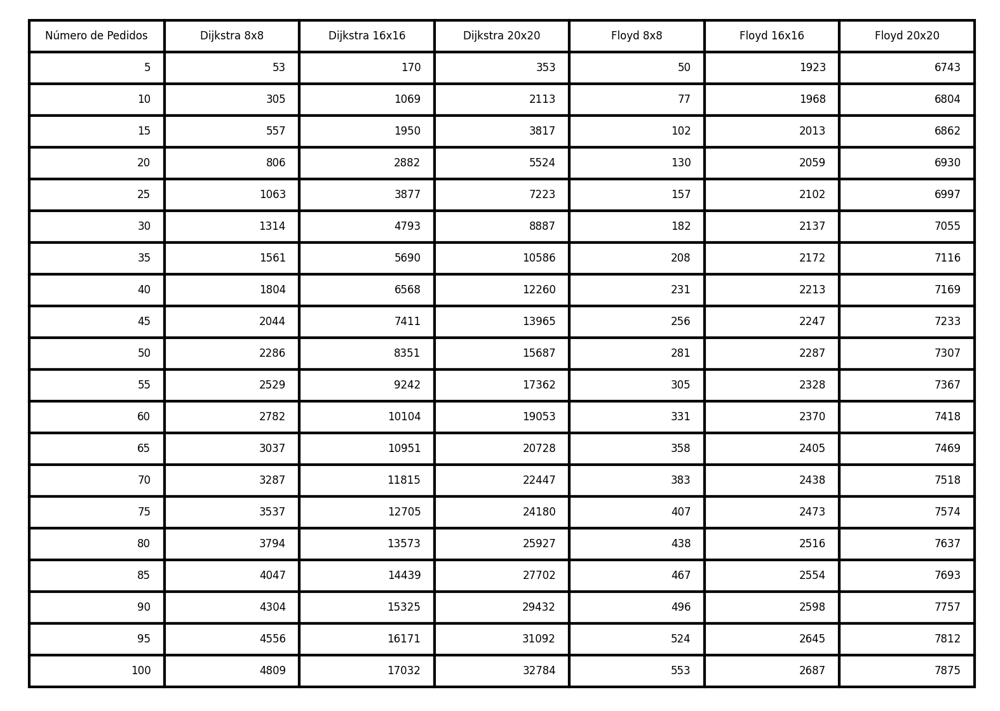

# 5. Implementação

Iniciada a parte de implementação prática de tudo o que foi discutido anteriormente, os dados de partida, mapas e código genérico foram recolhidos e as novas classes foram criadas, de acordo com tudo o que foi estabelecido como dados de entrada. É de notar que as soluções, disponibilizadas em código nas aulas práticas, para os grafos, vértices e arestas e respetivos algoritmos foram adaptadas e reorganizadas, para melhor satisfazerem as nossas necessidades.

## 5.1 Grafos e Mapas usados

Em matéria de testes, para uma possível readaptação futura em grafos com representação real de áreas urbanas, foram usados grafos em forma de grelha, de diversas dimensões e alguns com distâncias e arestas aleatoriamente distribuídas. A utilização de diferentes mapas com dimensões, em número de vértices, $N \times N$, permitiu uma mais fácil visualização de todo o processo e uma fundamentação mais cuidada na escolha de determinados algoritmos. Um exemplo de um grafo utilizado na implementação é o seguinte:

> Colocar aqui imagem de um grafo bonito com 20x20 ou assim qq coisa.

## 5.2 Análise empírica

Para uma análise generalizada e abrangente dos algoritmos tidos em consideração, estes foram testados em todos os grafos elegíveis e à nossa disposição. Os testes foram efetuados em conformidade com as fases de elaboração determinadas anteriormente e a sua eficiência temporal foi avaliada.

### 5.2.1 Fase I

Na Fase I de implementação, considerado o caso atómico de um estafeta que entrega apenas um pedido, entre um restaurante e a morada de um cliente, realizando todas as tarefas em sequência, foi calculada a média do tempo demorado na realização de 1 a 100 pedidos, para os algoritmos mais genéricos, neste caso, o Dijkstra unidirecional e o Floyd-Warshall. Os grafos considerados tinham dimensões variando entre $4 \times 4$ e $30 \times 30$, como relatam os seguintes dados:

  |  
:-------------------------:|:-------------------------:
  |  

Uma aproximação aos dados do grafo de dimensões $20 \times 20$, por exemplo, revela um pormenor interessante relativamente à concorrência entre estes dois algoritmos. A explicação para os valores reside no facto de o algoritmo de Floyd-Warshall demorar ligeiramente mais tempo, inicialmente, devido ao pré-processamento necessário, mantendo, de seguida, um tempo muito inferior de execução de cada pedido, sendo logo ultrapassado pelo algoritmo de Dijkstra, com um comportamento linear.

A partir de um certo número de pedidos, o algoritmo de Floyd-Warshall torna-se o mais viável, o que satisfaz as necessidades, a longo prazo, de uma aplicação deste tipo, tanto em grafos grandes, como em grafos mais pequenos, já que o custo de operação do algoritmo de Dijkstra aumenta consideravelmente.

  |  
:-------------------------:|:-------------------------:

Os valores mais precisos, em micro-segundos, para cada um destes gráficos, encontram-se na tabela seguinte:

Com isto, confirmamos também a complexidade temporal destes algoritmos e reafirmamos e fundamentamos as escolhas para as fases seguintes.

### 5.2.2 Fase II

Nesta segunda fase, voltámos a analisar a execução dos algoritmos, desta vez, tendo em conta a existência de vários estafetas e a distribuição de vários pedidos pelos funcionários disponíveis e elegíveis para os entregar. É de notar que a escolha do estafeta encarregue de determinado pedido era diretamente influenciada pela sua proximidade ao restaurante, o que implicava ainda mais cálculos intermédios e mais execuções dos algoritmos usados. Foram gerados, portanto, pedidos aleatórios e a cada tarefa concluída, o estafeta atualizava a sua posição. Para efeitos de teste da eficiência temporal desta fase de implementação, considerou-se a existência de 3 estafetas, distribuídos aleatoriamente por um grafo, representativo de uma área urbana, de dimensões $16 \times 16$, e geraram-se até 2000 pedidos também aleatórios. Os dados obtidos foram os seguintes:

> Falta o gráfico dos valores q já foram recolhidos

Bla bla bla dps escrevo