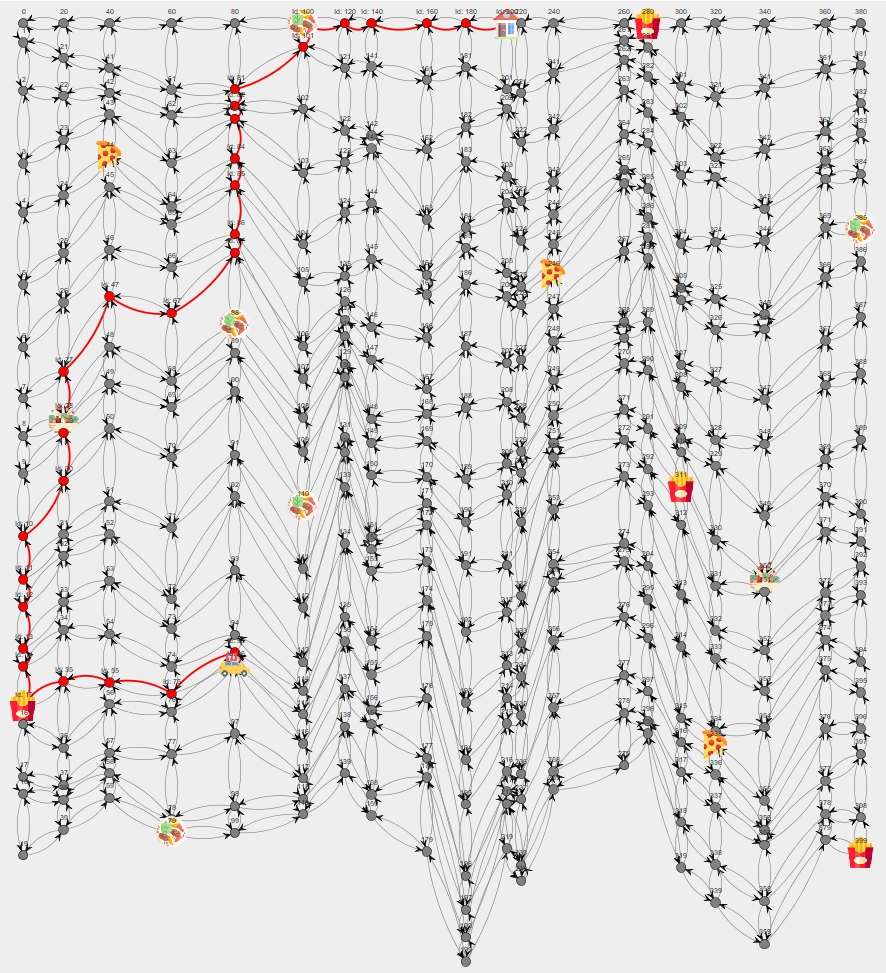

# Principais casos de uso implementados

Depois de todos os algoritmos estarem implementados e estudadas todas as questões relacionadas com a análise temporal e espacial, passamos para o desenvolvimento da solução para o contexto do projeto.

A aplicação desenvolvida, poderá ser utilizada em vários mapas (4x4, 8x8, 16x16, 20x20 e 30x30), cabendo ao utilizador escolher o mapa que deseja quando a aplicação se inicia.


Des seguida, irá ser perguntado ao utilizador se deseja visualizar o mapa escolhido, onde será possível visualizar a localização dos vários restaurantes.

Para todos os grafos apresentados será possível fazer um pedido que poderá conter apenas um restaurante entre os apresentados na lista ou então vários, sendo que para cada restaurante se escolhe quantas refeições se deseja deste, estando o tamanho total do pedido limitado a 15 refeições.

||
|:-------------------------:|
|Menu de escolha dos restaurantes para o grafo 20x20|

Depois de o pedido estar completo, serão apresentadas na aplicação as informações sobre o pedido, sobre o estafeta que o vai entregar, o caminho percorrido pelo estafeta desde a sua localização inicial até ao local de entrega, a distância total percorrida e o tempo estimado de espera. É ainda apresentado o grafo com o caminho percorrido pelo estafeta.

||
|:-------------------------:|
|Informções sobre o pedido e respetiva entrega|

||
|:-------------------------:|
|Caminho percorrido pelo estafeta|

Para os grafos maiores (16x16, 20x20 e 30x30), depois da seleção do mapa, será também dada ao utilizador a opção de se simular múltiplos pedidos aleatórios, além da opção descrita anteriormente.

Neste caso, o utilizador terá de escolher um número de estafetas entre 1 e 10 e o número de pedidos a simular, cujo máximo varia conforme o número de estafetas.

```cpp
int maxRequests = 15;
do{
        cout << "\t Number of employees (1 to 10) ?: ";
        cin >> employeesNum;
        cin.ignore(1000, '\n');
        cout << endl;
        if(employeesNum > 10 || employeesNum < 1) cout << "Try again!" << endl;
} while(employeesNum > 10 || employeesNum < 1);

    if(employeesNum < 3) maxRequests = employeesNum * 3;
```

||
|:-------------------------:|
|Introdução dos dados para simulação de pedidos|

De seguida, são apresentadas as informações sobre os pedidos gerados e sobre os estafetas criados, assim como as informações sobre a entrega de cada um dos pedidos, tal como acima foi descrito.

No final da lista, aparece um menu onde podemos escolher entre algumas possíveis visualizações dos grafos:

||
|:-------------------------:|
|Opções de visualização dos grafos|

**Opção A -** Visualizar o caminho percorrido pelo estafeta responsável por um certo pedido;

**Opção B -** Visualizar os percursos efetuados por um determinado estafeta;

**Opção C -** Visualizar os percursos efetuados por todos os estafetas.

Falta adicionar o caso de um estafeta entregar varios pedidos ao mesmo tempo